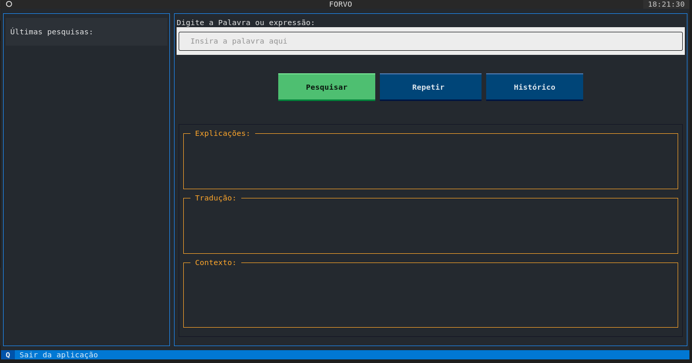

PROJETO FORVO-TEXTUAL
---------------------
A idéia do projeto forvo-textual consiste em consumir, via webscrapping, as pronúncias de palavras do site <https://www.forvo.com>.

Além disso, a aplicação do projeto faz um scraping no site <https://dictionary.cambridge.org> para obtenção da tradução, da explicação (em inglês) e de exemplo de uso daquela palavra pesquisada.

O objetivo principal do projeto é a prática e aprendizado do framework de Desenvolvimento chamado [Textual](https://textual.textualize.io/).

Textual é um framework de Desenvolvimento de Aplicações Rápidas para Python, construído pelo Textualize.io. 
Serve para criar interfaces de usuário sofisticadas com uma API Python simples. Permitindo a execução de aplicativos no terminal.

CONFIGURAÇÃO DO AMBIENTE
--------------------------
Primeiro, vamos clonar o repositório. Para isso, execute o comando abaixo (pressupondo a prévia instalação do git):

```bash
git clone https://github.com/AguinaldoAlecrim/forvo-textual.git
```
Entra no diretório:
```bash
cd forvo-textual/
```

Uma vez dentro da pasta do projeto, vamos criar um ambiente virtual para não misturar as coisas na nossa máquina local. É extremamente recomendável o uso de ambientes virtuais. 

Dentre as várias maneiras de criar um ambiente virtual em python, têm-se o uso do módulo venv. Para criar o ambiente virtual com o venv, basta executar o comando abaixo:
```bash
python -m venv venv
```
```bash
source ./venv/bin/activate
```

As biblioteas necessárias para a execução da aplicação (forvo-textual) estão incluídas no arquivo requirements.txt.

Para a instalação das dependências, basta executar o comando abaixo:
```bash
pip install -r requirements.txt
```
Uma vez instaladas as dependências, execute o comando ```pip freeze``` para checar se todas as dependências foram instaladas.
O resultado do comando deve ser algo parecido com isso:
```bash
beautifulsoup4==4.12.2
certifi==2023.7.22
charset-normalizer==3.2.0
idna==3.4
importlib-metadata==6.8.0
linkify-it-py==2.0.2
markdown-it-py==3.0.0
mdit-py-plugins==0.4.0
mdurl==0.1.2
pygame==2.5.0
Pygments==2.16.1
requests==2.31.0
rich==13.5.2
soupsieve==2.4.1
textual==0.32.0
typing_extensions==4.7.1
uc-micro-py==1.0.2
urllib3==2.0.4
zipp==3.16.2
```

EXTRAÇÃO E ORGANIZAÇÃO DOS DADOS:
---------------------------------
Os dados são extraídos e consumidos usando as bibliotecas requests, beautifulsoup4 e pygame, cunjuntamente para buscar, parsear o html da página e a reprodução dos streams de áudio.

INTERFACE DO USUÁRIO
-------------------
A interface do usuário da aplicação é desenhada usando a biblioteca textual do python, usando o conceito de TUI.

Uma TUI (Text User Interface) é uma forma de interface de usuário baseada em texto que permite interagir com um programa ou aplicativo por meio de comandos e exibição de informações em uma interface de texto. Ao contrário das interfaces gráficas de usuário (GUI), que usam elementos visuais como janelas, botões e ícones, as TUIs são executadas em um terminal ou console e são mais simples em termos de recursos e largura de banda. Elas são frequentemente usadas em aplicativos de linha de comando e oferecem uma maneira eficiente de interagir com programas por meio de texto. As TUIs podem incluir menus, caixas de diálogo e campos de entrada, permitindo que os usuários executem ações e visualizem informações de forma textual. Embora as TUIs possam ser menos intuitivas para usuários menos experientes, elas são eficazes em ambientes de linha de comando e podem ser mais acessíveis para usuários com deficiências visuais.

A imagem abaixo apresenta a tela inicial da aplicação:


O uso é muito simples. Basta digitar a palavra (em inglês) no campo identificado com o texto "Insira a palavra aqui" e clicar em "Pesquisar".
Feito isso, o usuário será capaz de ouvir a pronúncia da palavra pesquisada, bem como, poderá ler a Explicação acerca da palavra, sua tradução do Inglẽs para o Português e os exemplos de uso.


Se os textos de explicações, traduções ou exemplos, forem grande o suficiente para cortar a resposta, o usuário poder clicar na palavra em verde (no cando inferior direito do Label de resposta) para exibir o texto em Markdown completo.

Além disso, após pesquisar uma palavra, o usuário poderá clicar no botão "Repetir" para ouvir a última palavra pesquisada.

Também poderá clicar na lista de palavras localizada na barra lateral esquerda para ouvir sua pronúncia.
